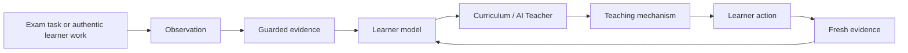

# EOT — English learning system for Taiwan GSAT

EOT is an adaptive AI English-learning system built around Taiwan's GSAT (學測) English exam. It started from a simple problem I met while preparing for the exam myself: English that looked familiar in recognition tasks did not always remain available when I had to translate or write.

The project has since expanded beyond output practice to cover all eight current GSAT learning/practice families used in this repository: **Vocabulary, Comprehensive, Contextual Fill, Discourse, Reading, Mixed, Translation, and Writing**.

The engineering focus is not “AI gives an explanation after a wrong answer.” EOT tries to model **what the learner has actually demonstrated, what may have caused the failure, what teaching action is justified next, and what later performance is strong enough to count as independent learning evidence**.

> **Project status:** active research and engineering work. The adaptive learning core has real implementation; the learner-facing UX is being rebuilt and integrated. This repository does **not** claim a finished product or validated learning efficacy. See [CURRENT_STATUS.md](CURRENT_STATUS.md).

## Why I built it

While preparing for GSAT English, I repeatedly saw a gap between recognition and use. A word could look familiar in a multiple-choice question, yet still fail when I needed to retrieve it, spell it, place it in a construction, translate with it, or use it in writing.

That led to the first version of EOT as an “output trainer.” As the learner model and teaching system developed, the scope widened: the same problem appears across the whole exam. A wrong answer alone does not explain why a learner failed, and a correct answer after help does not prove the learner can use the language independently.

EOT therefore evolved into a GSAT-specific adaptive learning system rather than a single output-practice tool.

## The problem EOT is trying to solve

EOT is organized around four questions:

1. **Why did the learner fail?**  
   The same visible error can come from different causes: unknown meaning, weak retrieval, spelling/form instability, collocation, grammar/construction, discourse reasoning, task load, or a simple slip.

2. **What should be taught next?**  
   A vocabulary gap, a spelling gap, a construction gap, and a reading-evidence gap should not all receive the same generic AI explanation.

3. **Did the learner actually learn it?**  
   Looking up an answer, succeeding with a model, or repeating the same context immediately after teaching is useful activity, but it is not automatically independent evidence.

4. **To what level can the learner use it?**  
   The system distinguishes evidence such as exposure, recognition, context discrimination, retrieval, spelling/form control, controlled production, independent production, changed-context transfer, and delayed retention instead of collapsing everything into one “mastery” number.

## How the system works



The important boundary is between **observation** and **evidence**. A learner action can be recorded without being allowed to change the learner model. Evidence guards track support, opportunity, provenance, context, uncertainty, and whether the learner actually had a fair chance to demonstrate the target.

Likewise, model output is a **proposal**, not learner truth. The Teacher runtime qualifies model proposals against the current LessonPlan, target/facet boundaries, registered teaching mechanisms, and evidence rules before execution.

## Example learning loop

A concrete implemented case is the spelling error:

```text
signigicant
```

The runtime does not have to conclude “the learner does not know significant.”

Current code can preserve competing explanations. If the learner has strong recent independent spelling history, the same surface error can be treated as a possible slip and routed toward self-repair. If the form has repeatedly failed without support, the Teacher can instead select an orthographic mechanism such as **spelling reconstruction**, then reduce support and move toward an unaided spelling check.

```text
Observation: "signigicant"
        ↓
candidate explanation: possible slip OR unstable orthographic production
        ↓
Learner Model + recent evidence
        ↓
Teacher decision
        ↓
self-repair OR spelling-specific teaching/practice
        ↓
support fade
        ↓
fresh unsupported check
        ↓
later transfer / retention evidence remains a separate claim
```

This is backed by the current Teacher regression cases and the registered spelling blocks; it is not presented here as a polished final learner UI.

Relevant implementation:
- `src/learner-truth/`
- `src/teacher-runtime/`
- `src/application/v4/blockRegistryV4.ts`
- `src/application/teacher/evalHarness.ts`
- `src/domain/teacher/TeacherRuntime.ts`

## Current development status

### Implemented / working core

These areas have current implementation and are used by, or connected to, the active learner path. “First pass” means implemented enough to execute and audit; it does **not** mean complete or efficacy-validated.

- **Canonical learner truth and shared learner model** — immutable observations/evidence, guards, uncertainty, competing hypotheses, assisted-vs-independent distinctions, transfer/delayed evidence, deterministic projection.
- **Curriculum / Outer Loop** — selects what is worth learning next and why, including prerequisite, reinforcement, transfer, retention, priority, and time-budget signals.
- **AI Teacher / Inner Tutor** — compiles bounded context, proposes/qualifies teaching actions, can change representation after failure, fade support, return to task, and fall back deterministically when model output is unavailable or invalid.
- **Teaching mechanisms / Learning Blocks** — registered learner actions and PCK metadata for selection, matching, ordering, reconstruction, retrieval, production, repair, comparison, planning, and return-to-task behavior.
- **Lesson / Session runtime** — lesson lifecycle, pause/resume, checkpoints, duplicate-action protection, time accounting, and continuity semantics.
- **GSAT practice path for all eight families** — current promoted task/content contracts, family-specific diagnosis candidates, Teacher interaction, and learner-action projection for Vocabulary, Comprehensive, Contextual Fill, Discourse, Reading, Mixed, Translation, and Writing.
- **Local persistence foundation** — native Expo SQLite operational schema, migrations, durable artifacts, evidence/Teacher lineage, bounded reads, and local replay/idempotency semantics.
- **Contextual lookup** — phrase-first/word fallback, contextual sense resolution, zh-TW explanation, lookup history, assessment locking, and the rule that lookup exposure is not capability evidence.
- **Authentic input / OCR pipeline** — direct text, paste, image and PDF intake; immutable original artifacts; learner work, prompt, teacher annotation and unknown-region separation; uncertainty can block diagnosis until reviewed.
- **AI/model boundary** — server-owned structured model calls, explicit operation contracts, prompt/schema versions, authority guards, timeout/retry ownership, and deterministic fallback boundaries.

### Currently being rebuilt / integrated

The repository already contains learner-facing screens and first-pass interaction renderers, but they are **not treated as final product design**. The current product work is rebuilding the learner-facing interaction model so that the adaptive Teacher, Teaching Blocks, support changes, return-to-task behavior, and lexical memory are understandable through the interaction itself rather than through internal engineering state.

Specialized depth is also uneven across families. Writing, Translation, broader language teaching, content generation, longitudinal scheduling, formal Exam behavior, and some measurement paths have active implementations or contracts but are not equally mature.

### Not finished yet

- server-authoritative truth, sync, cross-device continuity, and backup/restore;
- complete physical iOS/Android acceptance for process death, AppState races, keyboard/IME, screen reader, dynamic text, permissions, and difficult OCR/PDF layouts;
- a complete formal/mock GSAT experience and all post-assessment teaching flows;
- full specialized teaching coverage for every Writing, Translation, vocabulary/grammar/reading capability;
- broad calibrated content generation and difficulty/load control across the entire domain;
- calibrated model evaluation and real-learner efficacy evidence;
- final learner-facing interaction/visual system.

For the detailed and authoritative status, see [CURRENT_STATUS.md](CURRENT_STATUS.md).

## Technical architecture

The deeper architecture is documented in:

- [EOT V1 Main Architecture](docs/architecture/EOT_V1_MAIN_ARCHITECTURE.md)
- `src/architecture/registry.ts` — current subsystem ownership/maturity
- `src/architecture/capabilityCatalog.ts` — fine-grained implementation status
- `src/architecture/routeManifest.ts` — current production/secondary/dev routes

The A–Y subsystem notation, historical waves, authority boundaries, and implementation gates belong at this technical layer rather than the README opening.

## Repository navigation

If you only have a few minutes, these are the most useful places to inspect:

| Area | Current implementation |
| --- | --- |
| Learner evidence and model | `src/learner-truth/`, `src/domain/evidence/` |
| Curriculum / next-learning policy | `src/curriculum/` |
| AI Teacher runtime | `src/teacher-runtime/` |
| Teaching mechanisms / blocks | `src/teaching/`, `src/application/v4/blockRegistryV4.ts` |
| Eight-family GSAT practice/diagnosis | `src/content/examBetaBank.ts`, `src/application/exam/`, `app/exam-practice.tsx` |
| Reading specialization | `src/specializations/language/` |
| Writing / Translation specialization | `src/specializations/writing/`, `src/specializations/translation/` |
| Local persistence / SQLite | `src/persistence/` |
| Contextual lookup and lexical encounters | `src/lookup/`, `src/learner-truth/lexicalEncounter.ts` |
| Authentic input / OCR | `src/authentic-input/`, `coach-server/vision-v4.mjs` |
| Model boundary / server endpoints | `src/model/`, `coach-server/teacher-server.mjs` |
| Current learner-facing surfaces | `app/`, `components/learning/` |

## Reading status correctly

Repository tests and gates are engineering evidence. They can show that contracts, guards, transitions, persistence semantics, or regressions behave as specified in the tested cases. They **do not** by themselves prove that EOT improves real learners.

For current truth, use [CURRENT_STATUS.md](CURRENT_STATUS.md). Dated rebuild contracts, Codex prompts, closure reports, and older status documents are preserved as development history and are not current product authority.
